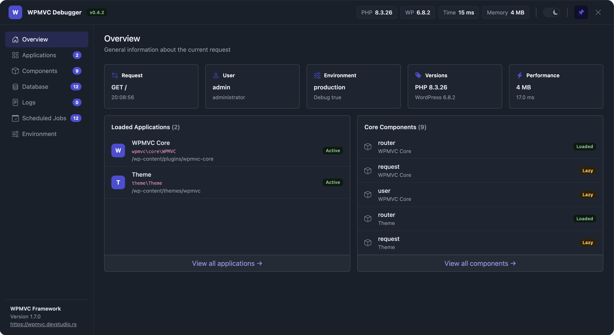
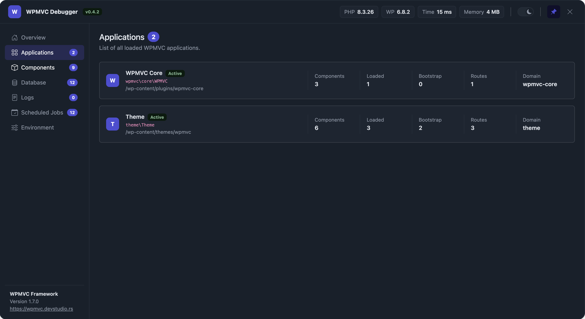
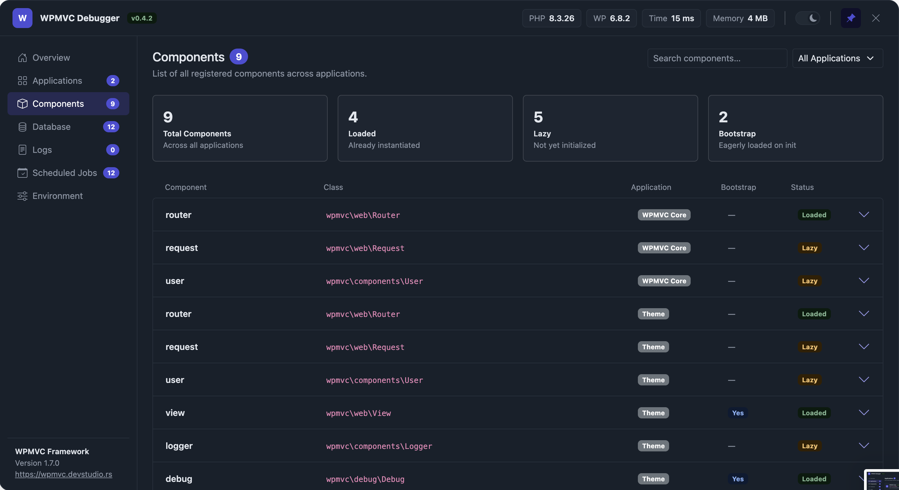
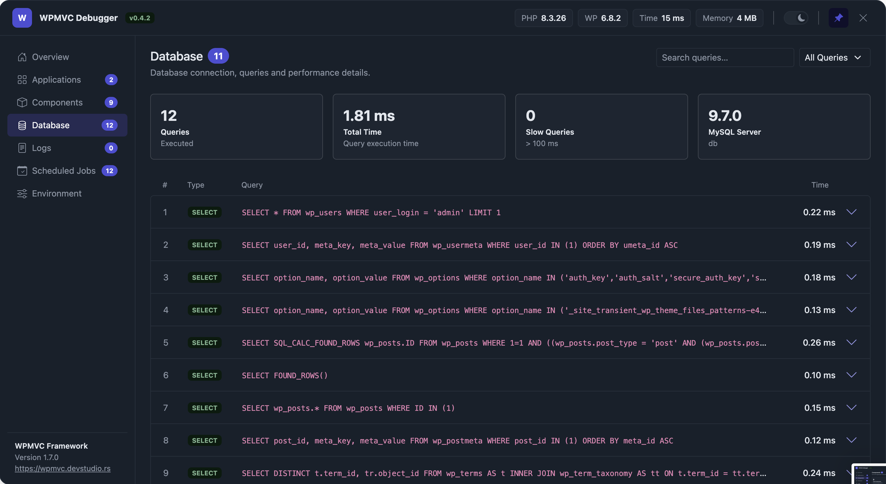
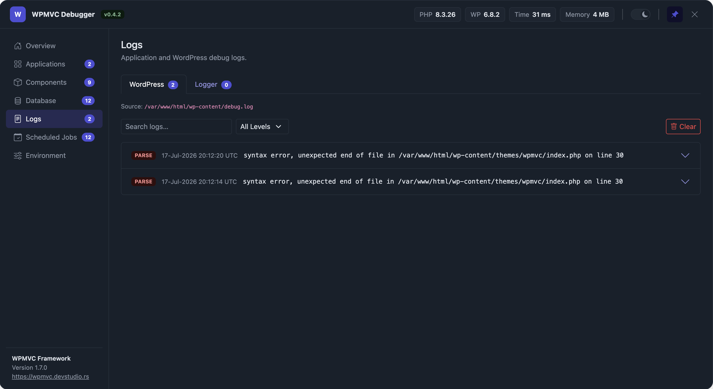
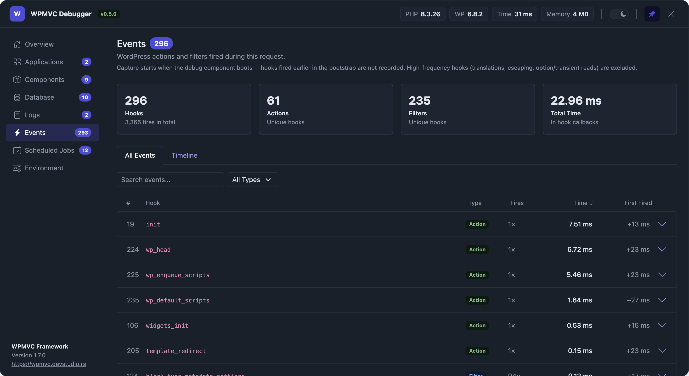
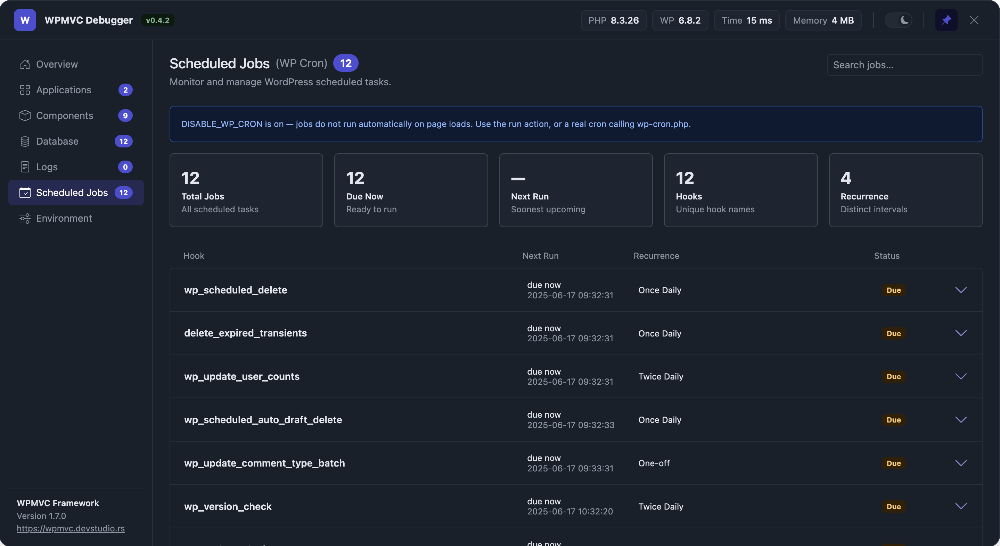
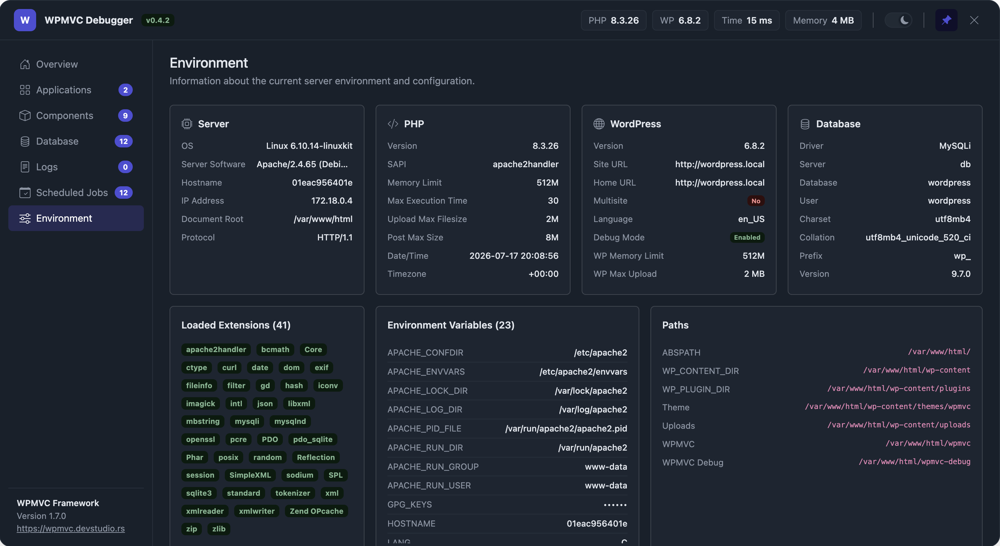

# WPMVC Debug

A debug toolbar for the [WPMVC framework](https://wpmvc.devstudio.rs). It adds a
floating button to the front end that opens a panel with everything you need to
inspect a request while developing: the initialized applications, their
components, database queries, logs, scheduled cron jobs and the server
environment.

It is a **development tool** — install it as a dev dependency and enable it only
in local/debug environments. The panel reads state and never alters your
application (the only writes are the explicit, admin-only log/cron actions).

- Bundled UI: Bootstrap 5.3 compiled with a `wpmvc-` prefix on every class and
  CSS variable, so it can't clash with a theme that already loads Bootstrap.
- Light/dark theme (dark by default), pinnable so it survives page reloads.
- No dependencies pulled at runtime; the framework is provided by the host app.

## Requirements

- PHP 7.0+
- WordPress with the WPMVC framework installed
- The package must live under `ABSPATH` (it derives its own asset URL from its
  location).

## Installation

Install as a dev dependency:

```bash
composer require --dev devstudio-rs/wpmvc-debug
```

Register it as a `debug` component in your application config, and add it to
`bootstrap` only in debug environments so it is never active in production:

```php
// config/main.php
'bootstrap' => WP_DEBUG ? array( 'view', 'debug' ) : array( 'view' ),

'components' => array(
    // ...
    'debug' => array(
        'class' => \wpmvc\debug\Debug::class,
    ),
),
```

That's all — the component enqueues its assets and renders the panel on
`wp_footer`. The panel is shown to everyone while enabled, but the log/cron
actions are restricted to users with `manage_options`.

> **Database queries** are captured through WordPress's `SAVEQUERIES`. The
> component defines it automatically when it isn't already set; to capture the
> queries that run *before* the debugger loads, define `SAVEQUERIES` in
> `wp-config.php`.

## Sections

### Overview

General information about the current request at a glance: method and path, the
current user, environment and debug flag, PHP/WordPress versions and
performance (peak memory + time). Below it, the loaded applications and a
preview of the registered components, each linking to its full tab.



### Applications

Every initialized WPMVC application instance, with its class, path and domain,
and how many components are declared, how many have actually been loaded (lazy
loading), how many are eager-loaded via `bootstrap`, and its registered route
count.



### Components

Every component declared across all applications, searchable and filterable by
application. Each row expands to show whether it is loaded or still lazy, if it
is a bootstrap component, and the config it was declared with.



### Database

The queries executed during the request (from `$wpdb->queries`), with a summary
of the query count, total time, slow queries and the database server. The list
is searchable, filterable by query type and sortable by time. Each query
expands to show the full SQL, its timing and the call stack that triggered it.



### Logs

Two sub-tabs: the **WordPress** debug log (`WP_DEBUG_LOG`) and the **Logger**
component's own files. Entries are grouped by level, searchable and filterable,
and each expands to its full message (including multi-line stack traces).
Administrators get a **Clear** button per log.



### Events

The WordPress actions and filters fired during the request, aggregated per
hook: type, fire count, total execution time and when it first fired. The
list is searchable, filterable by type and sortable by time (to surface the
slowest hooks first). Each row expands to timing details and the callbacks
registered on the hook
(priority, source, file and line). A **Timeline** sub-tab charts every hook
as a bar — positioned at its first fire within the request, sized by the
total time spent in its callbacks.

Capture starts when the component boots, so hooks fired earlier in the
bootstrap (mu-plugins and plugins loading) are not recorded. High-frequency
noise hooks (translations, escaping, per-option/transient reads) are
excluded, and recording is capped at 500 unique hooks per request.



### Scheduled Jobs

The WP-Cron schedule (`_get_cron_array()`): every event with its next run,
recurrence, arguments and status, plus summary stats. Administrators can expand
a job to **run it now** or **delete** it.



### Environment

Server, PHP, WordPress and database configuration, the loaded PHP extensions,
environment variables (secrets masked) and notable filesystem paths.



## License

MIT
